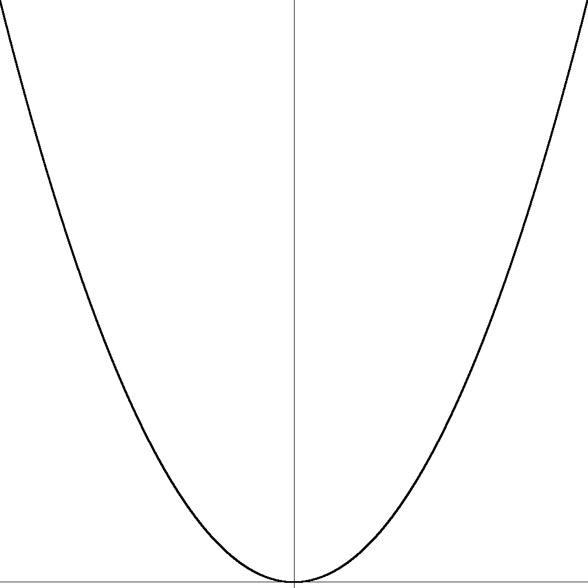
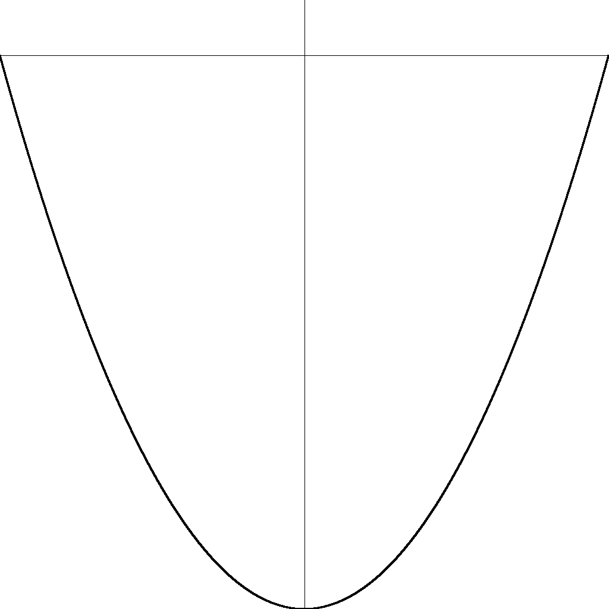
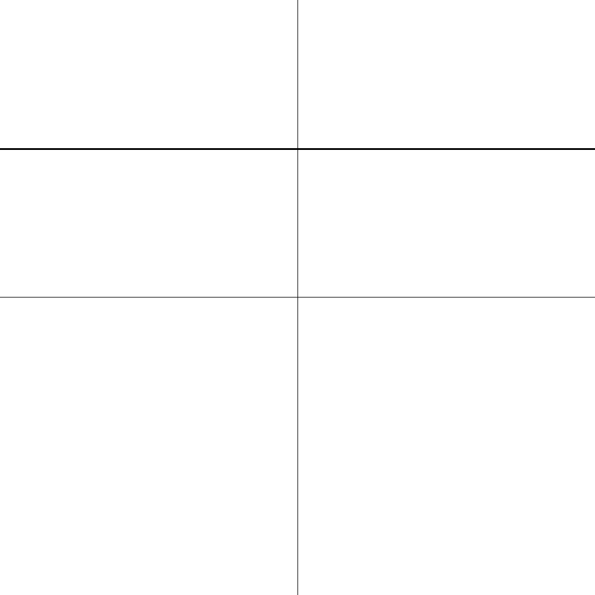

# BMP

## Варианты заданий

* Визуализация [стохастического процесса оценки числа Пи](../PI-Estimation)
* Рисование множества Мандельброта
* **Рисование графика произвольной функции, выводя её производные и интегралы**
* Преобразование картинок (чёрно-белое, поворот на 90 градусов, размытие)

## Пример визуализации функции

```
./drawer.out
out > Write intervals (left x, right x, bottom y, top y)
in < -10 10 -1 100
out > 
out > Write function and what to do with it
in < x^2
out > Function was successfully drawn
```



## Пример визуализации первообразной функции

```
./drawer.out
out > Write intervals (left x, right x, bottom y, top y)
in < -10 10 -50 5
out > 
out > Write function and what to do with it
in < Integral of x dx
out > Function was successfully drawn
```



> Первообразная задана так, что её значение в левой точке рассматриваемого интервала равняется нулю.

## Пример визуализации производной функции

```
./drawer.out
out > Write intervals (left x, right x, bottom y, top y)
in < -10 10 -2 2
out > 
out > Write function and what to do with it
in < x'
out > Function was successfully drawn
```


