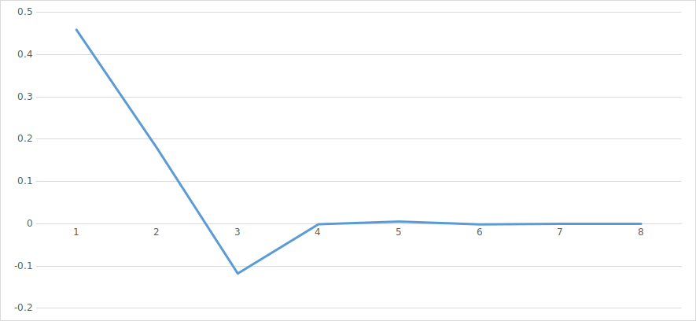

# Стохастическая оценка числа Пи

## Задание

С помощью метода Монте-Карло оценить число Пи через связь площадей квадрата и вписанного в него круга. Написать функцию, принимающую количество точек, и возвращающую оценку числа Пи. Вывести результат оценки числа Пи для разного количества точек: $10^1$, $10^2$, $10^3$, $10^4$, $10^5$, $10^6$ и ошибку относитетельно константы `M_PI`.

## Результат

| Степень точности ($\lg$ от количества итераций)| Полученное значение| Ошибка  |
|:----------------------------------------------:|:------------------:|:-------:|
|                                               1|            3.600000| 0.458407|
|                                               2|            3.320000| 0.178407|
|                                               3|            3.024000|-0.117593|
|                                               4|            3.140400|-0.001193|
|                                               5|            3.146760| 0.005167|
|                                               6|            3.140024|-0.001569|
|                                               7|            3.141967| 0.000375|
|                                               8|            3.141606| 0.000014|

