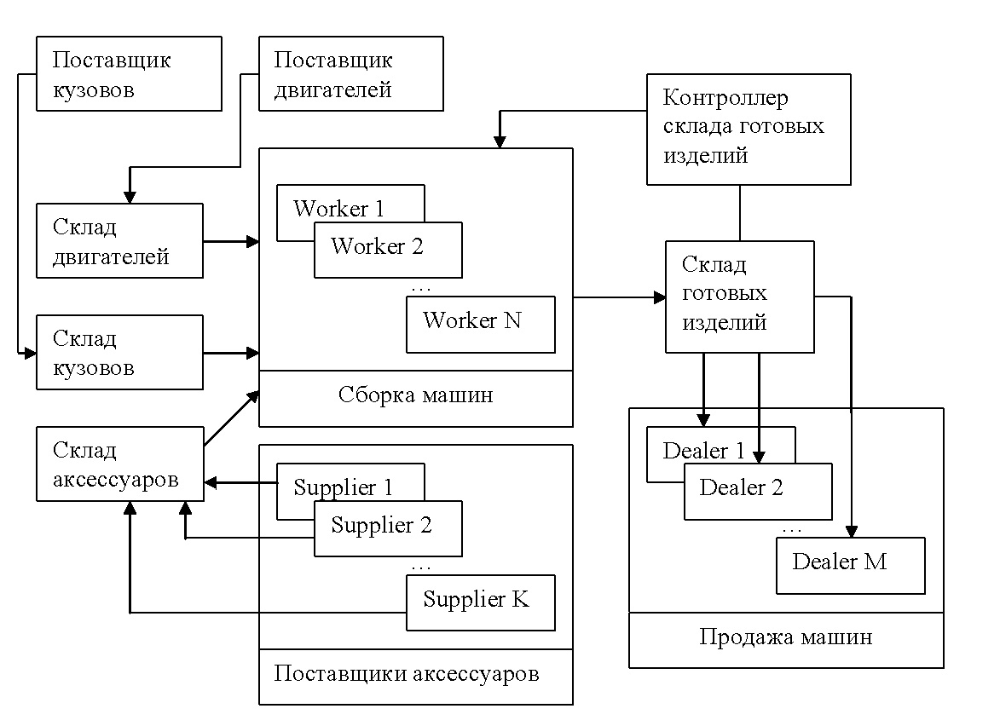

# Многопоточное программирование. «Эмулятор работы фабрики»

## Задание

Напишите приложение, эмулирующее работу фабрики по сборке автомашин. Машина состоит из 3-х частей: кузов, двигатель,
аксессуары. Машину надо собрать и отвезти на склад, откуда она поступает дилерам. Процесс работы фабрики показан на
картинке:

## Требования

1. Код должен быть организован в соответствии с паттерном MVC.
2. Сборка **Maven** обязательна.
3. Все склады имеют определенный размер, который нельзя превышать. Размеры складов, количество сборщиков, поставщиков и
   дилеров задаются в конфигурационном файле. Приложение предоставляет графический интерфейс, где можно смотреть
   основные параметры работы фабрики и контролировать процесс.
4. Каждый сборщик, поставщик и дилер должен работать в отдельном потоке. Для синхронизации можно использовать любые
   средства, входящие в стандартную библиотеку Java (включая пакет `java.util.concurrent`), а не только ключевое
   слово `synchronized` и мониторы (`wait/notify/notifyAll`). Наличие процедуры ожидания в виде цикла или
   использования `Thread.sleep()` автоматически ведет к непринятию задания. Каждая деталь — это отдельный объект.
   Хранить просто количество изделий/деталей нельзя — необходимо хранить непосредственно объекты. Каждый объект должен
   иметь уникальный идентификатор для отслеживания.
5. Потоки, которые представляют поставщиков деталей, поставляют одну деталь раз в *N* миллисекунд. Если какой-то склад
   деталей полон, то поставщик ожидает освобождения места для деталей. Скорость работы поставщиков определяется 3-мя
   ползунками (для каждого типа деталей). Должно отображаться кол-во деталей на каждом из складов в текущий момент и
   кол-во деталей, произведенных поставщиками (для поставщиков аксессуаров можно общий показывать).
6. Потоки, которые представляют дилеров, запрашивают со склада готовой продукции 1 машину в *M* миллисекунд. Скорость
   запрашивания машин можно регулировать ползунком в интерфейсе окна. Интерфейс также должен показывать кол-во
   произведенных машин (вообще) и кол-во машин на складе в данный момент. При отправке машины дилеру информация о
   покупке должна писаться в лог работы фабрики (в файл) в виде строки:

        <Time>: Dealer <Number>: Auto <ID> (Body: <ID>, Motor: <ID>, Accessory: <ID>)
   Включение/отключение лога контролируется с помощью специального параметра в конфигурационном файле.
7. Поток контроллера склада готовой продукции просыпается при любой отправке машины со склада продукции. Он анализирует
   состояние склада и передает запрос на изготовление новых машин (в случае необходимости) на фабрику.
8. На фабрике работает несколько потоков (сборщиков) в рамках `ThreadPool`. Задачами для `ThreadPool` являются запросы
   на создание новых машин (от контроллера склада готовых изделий). При выполнении такой задачи сборщик должен взять по
   одной детали, необходимой для сборки машины, с соответствующих складов. Если на складе нет нужной детали, то поток
   ждет поставки. Собирая новую машину, рабочий создает новый объект с помощью всех необходимых объектов, представляющих
   детали. После этого объект отправляется на склад готовой продукции. Если склад полон, то рабочий ждет освобождения
   места для новой машины. Интерфейс должен отображать, сколько всего было сделано машин и сколько задач еще ждут
   исполнителя (в очереди задач `ThreadPool`).
9. Конфигурационный файл должен предоставлять настройки для задания вместимости всех складов и количестве всех типов
   потоков. Примерный список параметров в конфигурационном файле (просьба использовать свои имена):

        StorageBodySize=100
        StorageMotorSize=100
        StorageAccessorySize=100
        StorageAutoSize=100
        AccessorySuppliers=5
        Workers=10
        Dealers=20
        LogSale=true
10. Классы объектной модели (деталь, склад, поставщик, сборщик и т.д.) не должны зависеть от библиотеки графического
    интерфейса.
11. Можно не писать пул потоков (`ThreadPool`) самостоятельно, а воспользоваться вместо этого пулами
    из `java.util.concurrent` (`Executors.newCachedThreadPool` или любой другой, подходящий под ваши задачи).
    Самостоятельная реализация пула потоков будет плюсом (полезна в учебных целях, чтобы лучше понять, как они
    работают). Работы, не использующие никакие пулы потоков (то есть, где под каждую таску создается свой собственный
    тред, который убивается после завершения работы и не переиспользуется в будущем для других задач) — не принимаются.
12. Программа должна корректно завершаться. При получении сигнала о закрытии окна все потоки должны корректно
    прерываться, и лог-файл закрываться.
13. Можно выбрать любой фреймворк для *GUI*, но это должен быть *GUI* (не консоль).
14. *UI*-тред никогда не должен блокироваться для ожидания каких-то событий (это приводит к "зависанию" интерфейса).
    Любое ожидание чего бы то ни было и любые сколь-нибудь длительные вычисления происходят за пределами *UI*-треда.
