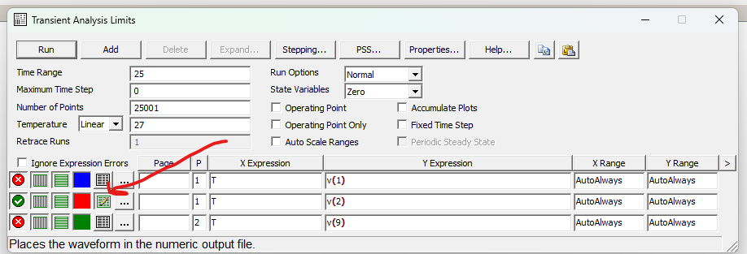
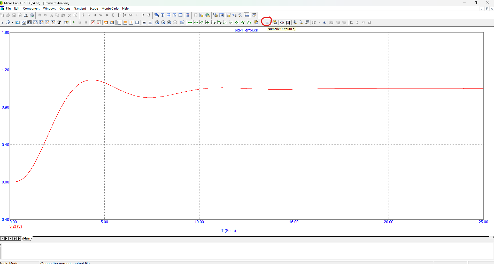

# Построение дискретной системы управления

## Задание

1. Построить дискретное представление системы для [ПИ](pi) и [ПИД](pid)-регуляторов из первого задания, то есть найти матрицы $A_d$, $B_d$, $C_d$ двумя способами: вручную (используя формулы) и средствами Scilab (используя `dscr`).
2. Вычислить и сравнить получаемые переходные характеристики систем из первого задания для обоих регуляторов, сравнить их с переходной характеристикой соответствующего регулятора из Microcap.

## Выполнение задания

1. Взять схемы для ПИ и ПИД-регуляторов из первого задания.
2. Построить графики переходной характеристики, то есть реакции на источник постоянного единичного сигнала, включив в настройках графика вывод данных и установив нужное количество точек ($N$), чтобы был соответствущий шаг ($h = (max_x - min_x) / N$)

3. Скопировать численные значения переходной характеристики в соответствующий файл.

## Описание файлов

* `<h>.txt` --- значения переходной характеристики при значении шага $h$
