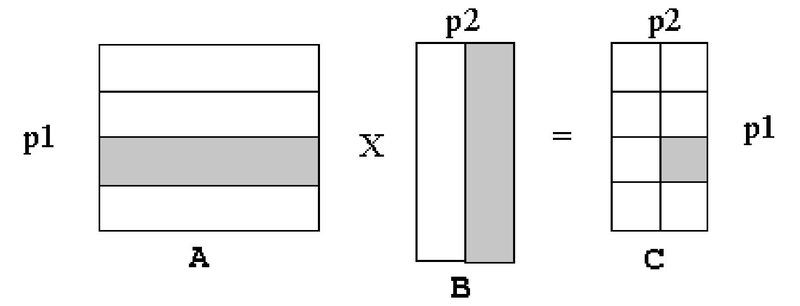
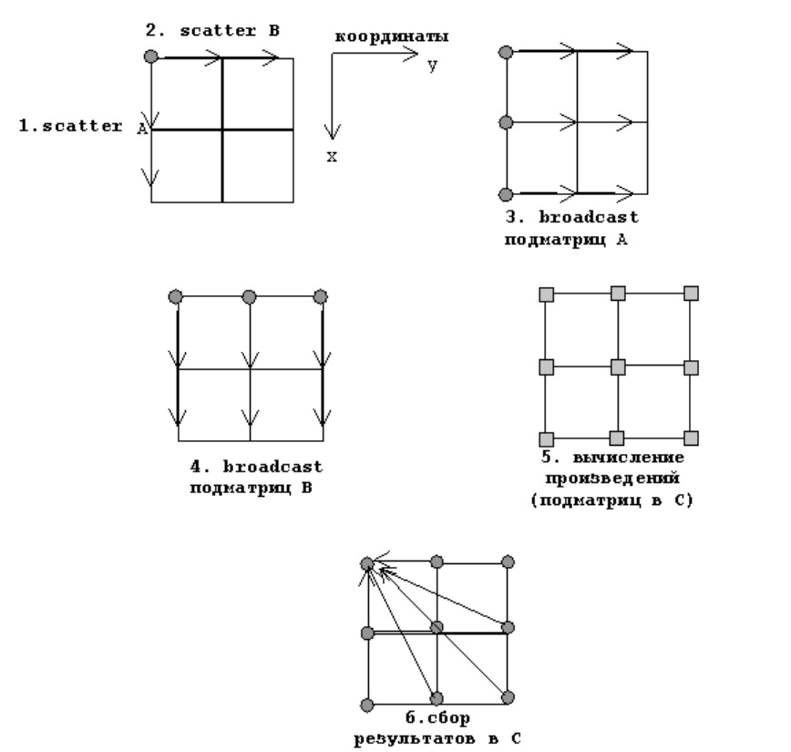

# Умножение матрицы на матрицу в MPI 2D решетке

## Задание

1. Реализовать параллельный алгоритм умножения матрицы на матрицу при 2D решетке процессов с соблюдением требований.
2. Исследовать производительность параллельной программы при фиксированном размере матрицы в зависимости от размера решетки: 2x12, 3x8, 4x6, 6x4, 8x3, 12x2. Размер матриц подобрать таким образом, чтобы худшее из времен данного набора было не менее 30 сек.
3. Выполнить профилирование программы при использовании 8-и ядер с решетками 2x4, 4x2.

## Требования

1. Использование декартовой топологии процессов и создание новых коммуникаторов. Использование производных типов данных.
2. Программа должна работать для матрицы $B$ любого содержания — предполагать, что матрица $B$ будет симметричной нельзя.
3. Транспонировать матрицу $B$ нельзя.
4. При раздаче матрицы $B$ по полосам каждый из процессов с координатами $(0; x)$ должен получить по одному элементу производного типа, а процесс $(0;0)$, соответственно, высылает процессам по одному элементу производного типа (не обязательно того же самого).

## Алгоритм

Вычисляется произведение $С$ = $А$ × $В$, где $А$ – матрица размера $n_1$ × $n_2$ и $В$ – матрица $n_2$ × $n_3$. Матрица результатов $С$ имеет размер $n_1$ × $n_3$. Исходные матрицы первоначально доступны на нулевом процессе, и матрица результатов возвращена в нулевой процесс. Параллельное выполнение алгоритма осуществляется на двумерной (2D) решетке компьютеров размером $p_1$ × $p_2$ . Матрицы разрезаны, как показано на рисунке: матрица $А$ разрезана на $p_1$ горизонтальных полос, матрица $В$ разрезана на $p_2$ вертикальных полос, и матрица результата $C$ разрезана на $p_1$ × $p_2$ подматрицы (или субматрицы).

Каждый компьютер $(i, j)$ вычисляет произведение $i$-й горизонтальной полосы матрицы $A$ и $j$-й вертикальной полосы матрицы $B$, произведение получено в подматрице $(i, j)$ матрицы $C$.

Последовательные стадии:

1. Матрица $А$ распределяется по горизонтальным полосам вдоль координаты $(x, 0)$.
2. Матрица $B$ распределяется по вертикальным полосам вдоль координаты $(0, y)$.
3. Полосы $А$ распространяются в измерении $y$.
4. Полосы $B$ распространяются в измерении $х$.
5. Каждый процесс вычисляет одну подматрицу произведения.
6. Матрица $C$ собирается из $(x, y)$ плоскости.

Осуществлять пересылки между компьютерами во время вычислений не нужно, т. к. все полосы матрицы $А$ пересекаются со всеми полосами матрицы $B$ в памяти компьютеров системы.

## MPI-функции, которые могут пригодиться

### Топологии процессов
- `MPI_Cart_create()`
- `MPI_Cart_coords()`
- `MPI_Cart_sub()`

### Производные типы данных
- `MPI_Type_commit()`
- `MPI_Type_free()`
- `MPI_Type_vector()`
- `MPI_Type_contiguous()`
- `MPI_Type_create_subarray()`
- `MPI_Type_create_darray()`
- `MPI_Type_struct()`
- `MPI_Type_create_resized()`

## Файл, который может пригодиться при выполнении работы — [MPI_from_Meleshko](MPI_from_Meleshko.pdf)
